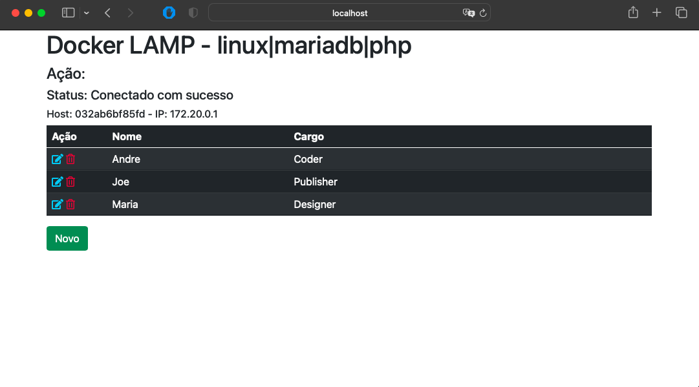

# Docker LAMP - linux|mariadb|php

Exemplo básico para construir container em docker com linux, mariadb e PHP

Para executar será necessário instalar o Docker Compose (sugiro instalar o Docker Desktop para conhecer melhor a ferramenta). Após a instalação do docker compose:
- no terminar da sua IDE preferida ou mesmo no console do SO que está utilizando, digite docker-compose up -d (para executar em background.
- para finalizar, docker-compose down

Importante:
- as informações de usuários e senhas aparentes são somente para dar um exemplo, portanto, não utilize dessa maneira em produção.

Este exemplo está com volume persistente, ou seja, ao parar o seu container, os seus dados não serão excluídos.

Excelente aprendizado!!!
